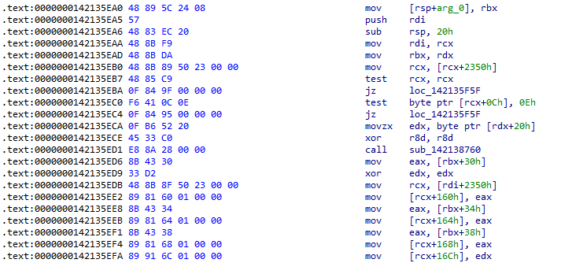
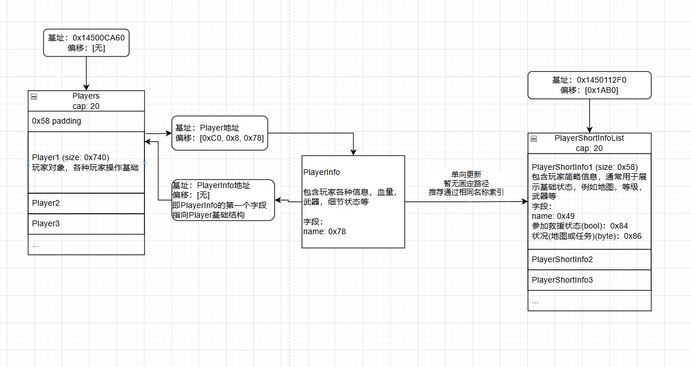

# MHW插件开发安全性修订指南

安全性高的插件，不易发生错误或出现非预期情况，同时也难以被不正确利用造成不良后果。本文基于经验，提出了一些提高插件安全性的推荐实践。

本文仅为推荐实践，未实现本文的推荐方法，并不代表插件安全性出现问题。相反，本文的推荐方法均属于进阶优化，并非作者义务范围内的优化内容。作者可以根据实际情况，采用合理的策略。

## 目录

1. 内存访问
2. 联机控制
	1. 多人游戏状态判断
	2. 参加救援状态判断
	3. 多人可控制的命令

## 内存访问

关于空指针、野指针，内存页访问权限等，本文不再赘述，对于插件属于基本要求，出现上述异常一般会导致游戏崩溃。

特别关注的是对于函数Hook或者AOB注入，可以采取更稳定的处理。

函数Hook，通常采用内联Hook（Inline Hook），即直接修改目标函数的开头几个字节，使其跳转到用户自定义代码。通常采用MinHook，或者其他Hook库例如safetyhook、detour等。这些库在Hook一个函数时，会在Hook位置写入5字节长度的E9 JMP命令跳转到用户自定义代码（或者Trampoline跳板区）。

通常提供一个地址，即可在对应位置设置Hook。但是这种方式不够稳定。例如源程序发生变化时，由于源代码变更，函数本身可能并不发生变化，但由于前后代码变化，会导致函数位置发生移动。针对此，开发者可以采用特征码扫描，在运行时动态定位函数位置。

特征码扫描通过搜索内存或可执行文件中的一组独特的字节序列（即特征码）来定位目标函数或数据结构。



以该函数头部片段为例，特征码可以为：

```text
48 89 ?? ?? ??
57
48 ?? ?? ??
48 8B F9
48 8B DA
48 8B ?? ?? ?? ?? ??
...仅供参考，忽略后续代码
```

如上所示，忽略掉相对和绝对地址，用通配占位符替代。实践中，由于MHW已经不进行大更新，可以认为函数中访问的结构通常是不变的，因此可以将一些有较高特征的偏移值保留，例如上文特征码最后一行可以写为`48 8B 89 50 23 00 00`，这样不需要太长的特征码就能找到全局**唯一**目标值。

但是特征码扫描有一个前提，就是特征码区域不能被其他程序更改，否则插件便无法搜索到对应区域。

为了避免这个问题，前文提到，当某个函数被Hook时，会在开头位置写入5字节长度的E9 JMP命令。因此可以控制特征码区域，避开函数头部至少5个字节，在函数中间进行扫描，最后将扫描到的结果向前偏移避开的字节数，即可实现特征码扫描不受其他插件影响。对于上述示例，应该丢弃开头的五个字节，即`48 89 ?? ?? ??`。最后扫描测试，拓展特征码长度，直到最终只有唯一一个结果即可。

特征码扫描效率高，且一般只在插件启动对每个特征码扫描一次，通常任意选用一个成熟的方案或库实现即可。推荐程序运行期间对同一特征码只扫描一次，后续使用缓存的值，以减少性能消耗。

## 联机控制

很多情况下，插件的功能和多人联机的纯净性相悖，因此需要保留一定的功能预防可能出现的问题。

### 多人游戏状态判断

判断当前任务中的玩家数量（仅包括目前参加了任务的，具体包括任务中，准备出发，准备就绪的玩家，不包括已退出但是占据了任务位置的玩家数量）。

基于此变量，可以对单人游戏和多人游戏情况进行判断，对不同情况分别处理。

> 基址：0x1451C2478
> 
> 偏移：\[0x258, 0x10, 0x6574]
> 
> 类型：int32
> 
> 期望值：\[0, 4]

CE表格快速复制：

```xml
<?xml version="1.0" encoding="utf-8"?>
<CheatTable>
  <CheatEntries>
    <CheatEntry>
      <ID>357</ID>
      <Description>"任务人数"</Description>
      <ShowAsSigned>0</ShowAsSigned>
      <VariableType>4 Bytes</VariableType>
      <Address>0x1451C2478</Address>
      <Offsets>
        <Offset>0x6574</Offset>
        <Offset>0x10</Offset>
        <Offset>0x258</Offset>
      </Offsets>
    </CheatEntry>
  </CheatEntries>
</CheatTable>
```

### 参加救援状态判断

当插件允许玩家多人组队，但是不允许玩家通过参加救援进入其他人的救难任务时，需要判断玩家是组队任务还是参加救援。

救援状态判断较为复杂，具体参考图表和代码片段示意：



如图所示，判断玩家是否参加救援，在`PlayerShortInfo`中体现。这是作者根据集会玩家列表中的“状况”字段反向查找。作者推测在`PlayerInfo`中一定有相关内容体现，但是能力不足暂未找到，因此绕了点弯路，也能稳定实现效果。

此处`PlayerShortInfoList`经过测试，不应该作为稳定列表使用，即该列表总是会变动，包括但不限于重复对象，空值等。使用前务必不要长期持有该区域的结构，取值前判空。

`PlayerShortInfoList`中的前四位是特殊的，前四位永远优先包含同一任务中的玩家，任务中无玩家时，结构为空。集会里的其他玩家可能会从第五位开始排列。

`Players`和`PlayerShortInfoList`都是无顺序且无自动排序的，即当有玩家加入/退出时，列表不会发生重排序，而是会原地留空或寻找最近的空位插入。

其中值得提出的是，玩家自己的玩家对象，永远是`Players`列表中的第四个，也就是基址：0x14500CA60，偏移：\[0x58 + 0x740 * 3]的位置。

或者也可以通过另一组地址，

> 基址：0x145011760
> 
> 偏移：\[0x50]

来找到，更为稳定。如果你只需要获取主机玩家，推荐采用后者。否则通过前者可以获得集会区域所有玩家的信息（包括参加救援的其他人）。

以下详细示例仅展示主机玩家数据获取路径。如需要获取其他玩家的相同数据，请参阅上文路径图。

接下来获取玩家名称。主机玩家名称可以通过以下指针路径获取：

> 基址：0x145011760
> 
> 偏移：\[0x50, 0xC0, 0x8, 0x78, 0x78]
> 
> 类型：以空字节结尾的字符串（C风格字符串）

CE表格快速复制：

```xml
<?xml version="1.0" encoding="utf-8"?>
<CheatTable>
  <CheatEntries>
    <CheatEntry>
      <ID>99</ID>
      <Description>"玩家名字"</Description>
      <ShowAsSigned>0</ShowAsSigned>
      <VariableType>String</VariableType>
      <Length>24</Length>
      <Unicode>0</Unicode>
      <CodePage>0</CodePage>
      <ZeroTerminate>1</ZeroTerminate>
      <Address>0x145011760</Address>
      <Offsets>
        <Offset>0x78</Offset>
        <Offset>0x78</Offset>
        <Offset>0x8</Offset>
        <Offset>0xC0</Offset>
        <Offset>0x50</Offset>
      </Offsets>
    </CheatEntry>
  </CheatEntries>
</CheatTable>
```

从`PlayerShortInfoList`中查询主机玩家：

```rust
// 伪代码
for index in [0, 3) {
  获取名称 {
    基址：0x1450112F0
    偏移：[0x1AB0 + 0x58 * index, 0x49]
  }
  如果 获取到的名字 == 玩家的名字 {
    return PlayerShortInfo
  }
}
```

CE表格快速复制：（请自行修改偏移值）

```xml
<?xml version="1.0" encoding="utf-8"?>
<CheatTable>
  <CheatEntries>
    <CheatEntry>
      <ID>395</ID>
      <Description>"PlayerShortInfo01"</Description>
      <ShowAsSigned>0</ShowAsSigned>
      <VariableType>4 Bytes</VariableType>
      <Address>0x1450112F0</Address>
      <Offsets>
        <Offset>0</Offset>
        <Offset>0x1AB0 + 0x58 * 0</Offset>
      </Offsets>
      <CheatEntries>
        <CheatEntry>
          <ID>434</ID>
          <Description>"名字"</Description>
          <ShowAsSigned>0</ShowAsSigned>
          <VariableType>String</VariableType>
          <Length>32</Length>
          <Unicode>0</Unicode>
          <CodePage>0</CodePage>
          <ZeroTerminate>1</ZeroTerminate>
          <Address>0x1450112F0</Address>
          <Offsets>
            <Offset>0x49</Offset>
            <Offset>0x1AB0 + 0x58 * 0</Offset>
          </Offsets>
        </CheatEntry>
        <CheatEntry>
          <ID>435</ID>
          <Description>"0x84 是否参加救援"</Description>
          <ShowAsSigned>0</ShowAsSigned>
          <VariableType>Byte</VariableType>
          <Address>0x1450112F0</Address>
          <Offsets>
            <Offset>0x84</Offset>
            <Offset>0x1AB0 + 0x58 * 0</Offset>
          </Offsets>
        </CheatEntry>
        <CheatEntry>
          <ID>436</ID>
          <Description>"0x86 状况（地图或任务）"</Description>
          <ShowAsSigned>0</ShowAsSigned>
          <VariableType>Byte</VariableType>
          <Address>0x1450112F0</Address>
          <Offsets>
            <Offset>0x86</Offset>
            <Offset>0x1AB0 + 0x58 * 0</Offset>
          </Offsets>
        </CheatEntry>
      </CheatEntries>
    </CheatEntry>
  </CheatEntries>
</CheatTable>
```

要实现状态判断，首先知道什么状态值会显示“参加救援”。

当`0x86`偏移值为7时，表示玩家在任务中，此时状况显示“任务”。

在以上前提下，当`0x84`偏移值为1时（即`bool`值`true`），表示玩家在任务中，且参加救援，此时状况显示“参加救援”。

因此，判断`0x86`偏移值为7且`0x84`偏移值为1时，表示玩家正处于参加救援状态。

实际只判断`0x84`偏移值为1*应该*可行。

### 多人可控制的命令

MHW中，由于缺少独立的MOD控制台，玩家在游戏中对MOD进行操纵的方式有限，常见方式有快捷键、利用游戏内的聊天栏作为命令终端等。通过获取用户输入文本作为命令处理，具有灵活性高的特点，因此常用作复杂插件的游戏内交互手段。

实现聊天栏命令的方式有很多，下面介绍一种方法，在多人游戏中，可以允许他人发送的文本作为命令输入，让房间内其他人可以控制主机的MOD，以提高多人游戏安全性和便利性。

介绍一个简单实现方案（轮询数据）：

最近接收到的消息会存放在一个缓冲区，通过轮询缓冲区即可获取消息。

消息长度：

> 基址：0x144F85DB0
>
> 偏移：\[0xBC]
>
> 类型：int32

消息体：

> 基址：0x144F85DB0
> 
> 偏移：\[0xC0]
> 
> 类型：字符串（长度为消息长度，无空字节结尾）

轮询消息体，若检测到消息为命令格式，则进行**消费**，即先读取数据，然后将该处消息体填充0，消息长度设置为0，以避免重复读取问题，或避免多次输入同一命令。

如果需要高性能、非轮询方案，则直接查找该区域的访问者，找到某个函数进行Hook即可，查找函数较为简单，此处不再赘述。
